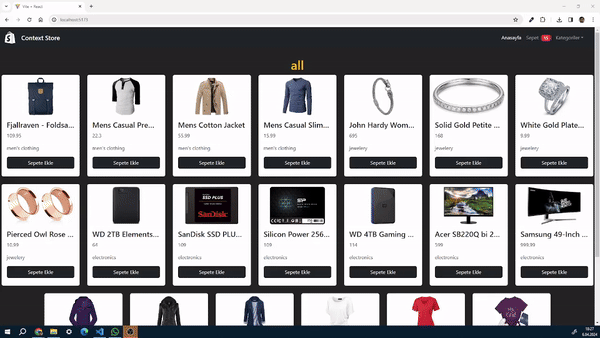

# E-Ticaret Projesi React

## Proje Hakkında

<h4>Bu Proje React ve kütüphanelerinin davranışlarını incelemek adıyla geliştirilmiştir.Fake Apı kullanılmıştır </h4>

## Kullanılan Teknolojiler

- **@uidotdev/usehooks:** Özelleştirilmiş React hook'larının kullanımını sağlar.
- **axios:** HTTP istekleri yapmak için kullanılan kütüphane.
- **bootstrap:** Hızlıca UI bileşenleri oluşturmak için kullanılmıştır.
- **react:** Kullanıcı arayüzünün geliştirilmesi için kullanılan JavaScript kütüphanesi.
- **react-dom:** React uygulamalarının DOM'a render edilmesini sağlar.
- **react-icons:** İkon setini kullanmak için kullanılmıştır.
- **react-router-dom:** Single-page uygulama içerisindeki route'ları yönetmek için kullanılmıştır.
- **react-toastify:** Bildirimlerin gösterilmesi için kullanılmıştır.
- **react-ContexAPI:** Prop Drilling yaptıgımız state yönetimine nazaran Performansı arttırılmak,State yönetimini daha ulaşılabilir hale getirmek ve Kod Düzenini Okunabilirliğini geliştirmesi amacıyla kullanılmıştır. 

### Ekran Görüntüsü

